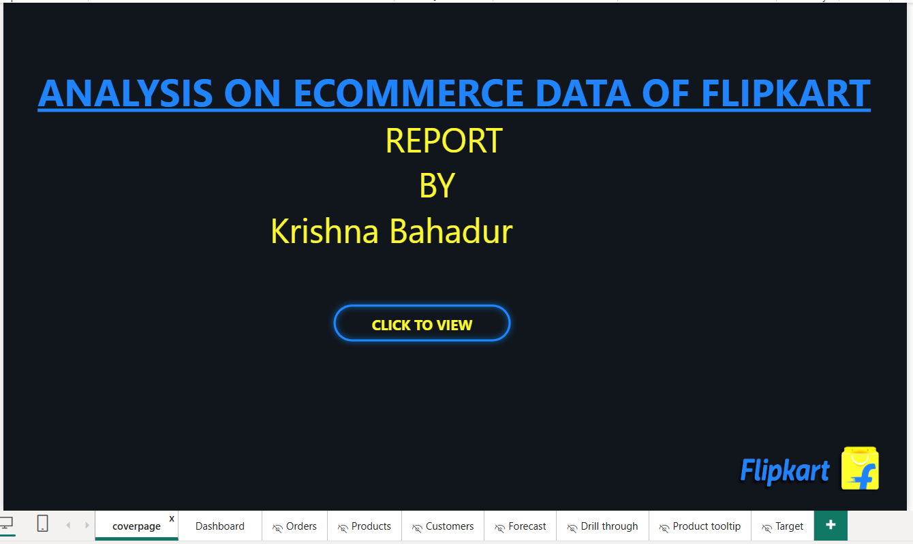

# E-Commerce Sales Data Analysis Using Power BI

## 1. Project Title
**E-Commerce Sales Data Analysis Using Power BI**

## 2. Project Description
E-commerce businesses generate massive amounts of sales data, but extracting meaningful insights to optimize performance can be challenging. Traditional methods are often time-consuming and lack the visual clarity needed to identify trends and customer behavior. This is akin to sifting through mountains of unorganized information – while the data is there, it requires significant effort to clean, analyze, and transform it into actionable knowledge.

This project proposes a solution: a comprehensive Power BI report that acts as a compass, guiding us through this vast data landscape. By leveraging Power BI's visualizations, we can better understand orders, product performance, customer trends, and profitability. This analysis will empower data-driven decisions to optimize pricing, target marketing efforts, and ultimately drive business growth.

**Data Source:** Flipkart Sales Dataset - This dataset is initially available in "xlsx" format, which is used for the analysis "Flipkart Sales Dataset.xlsx" file, which contains the details of the sales.

## 3. Project Objectives
- Analyze e-commerce sales data to identify key performance indicators
- Create interactive dashboards for order insights and trends
- Evaluate product performance and customer behavior patterns
- Develop profit analysis and forecasting models
- Provide actionable insights for business optimization
- Enable data-driven decision making through visual analytics

## 4. Tools Used and Their Usage in Project

### Power BI
- **Data Import & Transformation:** Loading and cleaning the Flipkart sales dataset
- **Data Modeling:** Creating relationships between different data tables
- **DAX Calculations:** Implementing custom measures and calculated columns for advanced analytics
- **Visualization:** Building interactive charts, graphs, and dashboards
- **Report Creation:** Developing comprehensive multi-page reports with drill-down capabilities

### Microsoft Excel
- **Data Source:** Initial dataset storage and preliminary data inspection
- **Data Preparation:** Basic data cleaning and formatting before Power BI import

## 5. Project Details and Implementation

### Data Processing Steps:
- Data loading and inspection
- Handling missing values and empty rows
- Data cleaning and formatting
- Converting the data into a table
- Modifying into a schema through Relationship
- Usage of DAX for calculation purposes
- Creating dashboards through the Visuals
- Preparation of Report Documentation

### Report Pages and Screenshots:

#### Cover Page
The professional cover page provides an overview of the E-Commerce Sales Analysis project, setting the context for stakeholders.

#### Main Dashboard Page
The central dashboard displays key metrics including total sales, profit margins, order volumes, and performance indicators. This page serves as the executive summary with high-level KPIs for quick decision-making.

#### Order Insights Page
This page focuses on order analysis including order trends over time, seasonal patterns, order status distribution, and geographical analysis of orders. It helps understand ordering behavior and identify peak sales periods.

#### Product Insights Page
Dedicated to product performance analysis, this page shows top-selling products, category-wise sales, product profitability, and inventory insights. It enables product managers to optimize product mix and pricing strategies.

#### Customer Insights Page
This page analyzes customer behavior including customer segmentation, purchase patterns, customer lifetime value, and demographic analysis. It supports targeted marketing and customer retention strategies.

#### Profit Insights & Forecast Page
The final page focuses on profitability analysis and future forecasting, including profit trends, margin analysis, and predictive models for future sales and profit projections.

### Key Features Implemented:
- Interactive filters and slicers for dynamic data exploration
- Cross-page filtering for seamless navigation
- Custom DAX measures for complex calculations
- Responsive design for different screen sizes
- Drill-down capabilities for detailed analysis
- Time intelligence functions for temporal analysis

## 6. Project Conclusion and Learning Outcomes

### Project Conclusion:
This Power BI project successfully transformed raw e-commerce sales data into actionable business insights. The comprehensive dashboard solution provides stakeholders with:

- **Real-time visibility** into sales performance and trends
- **Data-driven insights** for strategic decision making
- **Interactive visualizations** that enable self-service analytics
- **Forecasting capabilities** for future planning
- **Customer and product intelligence** for targeted strategies

The project demonstrates the power of modern business intelligence tools in converting complex datasets into meaningful business value.

### Key Learning Outcomes:

#### Technical Skills Developed:
- **Power BI Proficiency:** Mastered advanced Power BI features including DAX, data modeling, and visualization techniques
- **Data Transformation:** Learned efficient data cleaning and preparation methods using Power Query
- **Business Intelligence:** Gained experience in designing user-friendly dashboards and reports
- **Data Analysis:** Developed skills in identifying patterns, trends, and insights from large datasets

#### Business Intelligence Concepts:
- **KPI Development:** Understanding how to define and measure key performance indicators
- **Data Storytelling:** Learning to present data insights in a compelling and actionable manner
- **User Experience Design:** Creating intuitive interfaces for non-technical stakeholders
- **Performance Optimization:** Implementing best practices for report performance and scalability

#### Analytical Thinking:
- **Problem-Solving:** Approaching business challenges through data-driven methodologies
- **Critical Analysis:** Evaluating data quality and making informed decisions about data treatment
- **Strategic Thinking:** Connecting data insights to business outcomes and recommendations

This project reinforced the importance of clean data, thoughtful visualization design, and the need to always consider the end-user experience when creating business intelligence solutions.

---

---

**Project Status:** Completed  
**Last Updated:** November 2025 
**Technologies:** Power BI, DAX, Power Query, Microsoft Excel
